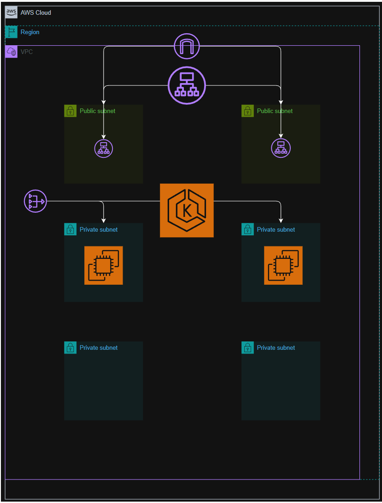

# Amazon EKS Cluster Deployment with Terraform

## Team Members

* **Marwan Emam** – Setup & S3 Backend, Compute & EKS (3.3–3.6), App Deployment
* **Omar Osama** – Networking Module, Compute & EKS (3.1, 3.2, 3.7, 3.8), Documentation

---

## Project Overview

This project demonstrates the deployment of a production-grade Amazon EKS cluster using Terraform (Infrastructure as Code).

### Architecture Includes:

* Custom VPC with multi-AZ subnets
* Amazon EKS cluster (Kubernetes v1.31)
* Managed node group
* AWS Load Balancer Controller
* Private ECR repository
* Jump Server (SSM-only access)
* Nginx containerized application deployed via Kubernetes
* ALB Ingress exposing the application

The infrastructure is modularized into Terraform modules with remote state stored in S3.

---

## Architecture



### Components

| Layer         | Component                    | Purpose                            |
| ------------- | ---------------------------- | ---------------------------------- |
| Network       | VPC (10.10.0.0/16)           | Multi-AZ network isolation         |
| Public        | ALB + NAT Gateway            | Internet access & outbound routing |
| Private       | EKS Nodes + Jump Server      | Application & management           |
| Orchestration | Amazon EKS                   | Managed Kubernetes control plane   |
| Registry      | Amazon ECR                   | Private container registry         |
| Ingress       | AWS Load Balancer Controller | ALB management via Kubernetes      |
| IaC           | Terraform                    | Infrastructure automation          |

---

## Prerequisites

### Local Tools

* Terraform >= 1.5.0
* AWS CLI >= 2.x
* kubectl >= 1.29
* Helm >= 3.12
* Git
* Docker

---

## Project Structure

```
VARROW_GRADUATION_PROJECT/
├── README.md
├── docs/
│   └── Screenshots/
├── k8s/
├── scripts/
│   └── create-s3-backends.sh
└── terraform/
    ├── networking/
    └── compute/
```

---

## Deployment Instructions

### 1. Clone Repository

```bash
git clone <repository-url>
cd <repository-name>
```

### 2. Create S3 Backends

```bash
bash scripts/create-s3-backends.sh
```

### 3. Deploy Networking

```bash
cd terraform/networking
terraform init
terraform validate
terraform plan
terraform apply
```

### 4. Deploy Compute

```bash
cd ../compute
terraform init
terraform validate
terraform plan
terraform apply
```

### 5. Configure kubectl

```bash
aws eks update-kubeconfig --name varrow-eks-cluster --region us-east-1
kubectl get nodes
```

### 6. Install ALB Controller

```bash
helm repo add eks https://aws.github.io/eks-charts
helm repo update

helm install aws-load-balancer-controller eks/aws-load-balancer-controller \
  -n kube-system \
  --set clusterName=varrow-eks-cluster \
  --set serviceAccount.create=false \
  --set serviceAccount.name=aws-load-balancer-controller
```

### 7. Deploy Application

```bash
docker pull nginx:latest
docker tag nginx:latest <ecr-uri>:latest
docker push <ecr-uri>:latest
```

### 8. Apply Kubernetes Manifests

```bash
kubectl apply -f k8s/deployment.yaml
kubectl apply -f k8s/service.yaml
kubectl apply -f k8s/ingress.yaml
```

---

## Kubernetes Configuration

### Deployment

* 2 replicas
* Uses ECR image

### Service

* ClusterIP
* Port 80

### Ingress

* Internet-facing ALB
* Target type: IP
* HTTP (port 80)

---

## Configuration

### AWS Credentials

```bash
aws configure
```

### Terraform Variables

Defined in:

* `terraform/networking/variables.tf`
* `terraform/compute/variables.tf`

---

## Testing

* **ALB Access:** Nginx page loads via ALB DNS
* **Node Health:** `kubectl get nodes` → Ready
* **Pods:** `kubectl get pods` → Running
* **Scaling:** Scale deployment to 3 replicas
* **Self-healing:** Delete pod → auto recreation

---

## Troubleshooting

* **ALB not provisioning:** Check subnet tags
* **Nodes not ready:** Verify IAM roles & security groups
* **Controller crash:** Check OIDC & service account

---

## Cleanup

```bash
cd terraform/compute
terraform destroy -auto-approve

cd ../networking
terraform destroy -auto-approve

aws ecr delete-repository --repository-name varrow-nginx --force
```

---

## Lessons Learned

* Importance of subnet tagging for ALB
* Terraform remote state management
* IAM configuration for EKS
* Kubernetes self-healing
* Infrastructure dependency handling
* Cloud cost awareness

---

## References

* AWS EKS Documentation
* Terraform AWS Provider Docs
* AWS Load Balancer Controller Docs
* Kubernetes Docs
* Helm Docs
